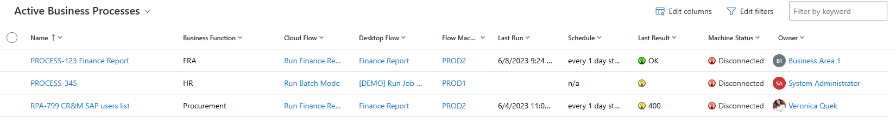
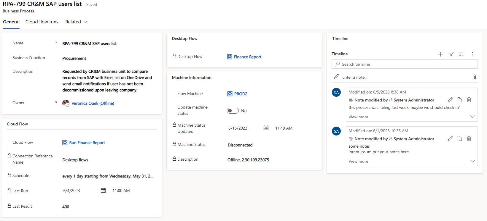
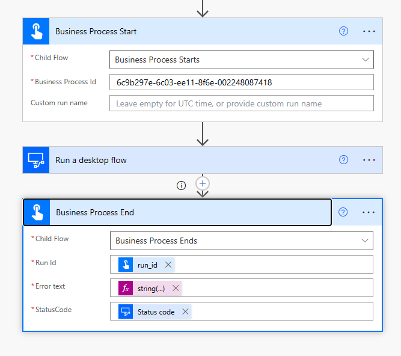

#PowerAutomate #PowerAutomateCloud #Dataverse

# Power Automate Monitoring

A simple custom entity to wrap your automation solution elements in one place - made for organizations where **1** cloud flow connects to **1** desktop flow and runs on **1** specific machine (machine can be reused by other flows).

With this tool, you can build your custom oversight dashboards spanning all components required by your solution, and adding business context such as:
* automation name
* business department/function
* owner or team of owners

## How does it work?
Here's a list of your automations. Icons indicate last process outcome and whether a machine is connected to Power Automate 

And here you can see the details of the process:

## What are the built-in features?
* you can put your own appropriate automation name, business function, and attach notes through timeline control
* adding a cloud flow link (or updating it) will automatically link your automation record to the 1st desktop flow called from it, and will update the connection reference name
* adding a machine link will retrieve it's status (connected/offline) and software version
* flipping the "Update machine status" switch will update the connected/offline state (your switch will return to off when it's done, make sure you refresh the screen to see new data)
* also, all machines are queried for their status every 30 minutes

# How to enable your cloud processes to store their start/stop info
Here's an example:

## Business Process Start
Call "Business Process Starts" child flow. Pass the guid of your automation record (it's the last part of URL when the monitoring app's screen is open on that particular process.

## Business Process End
* Run Id: <code>body('Business_Process_Start')?['run_id']</code>
* Error text: <code>string(body('Run_a_desktop_flow'))</code> (make sure you put you own name for the desktop flow action)
* StatusCode: <code>outputs('Run_a_desktop_flow')?['statusCode']</code>

## Notes
There are no security roles provided, but you're welcome to extend this solution with a dedicated security role. You might consider creating a read-only role and one where people would only be able to see or modify their own automations.
